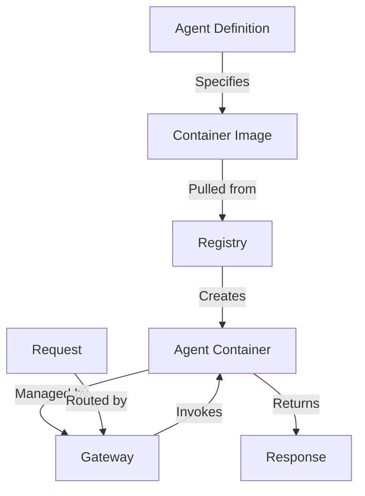
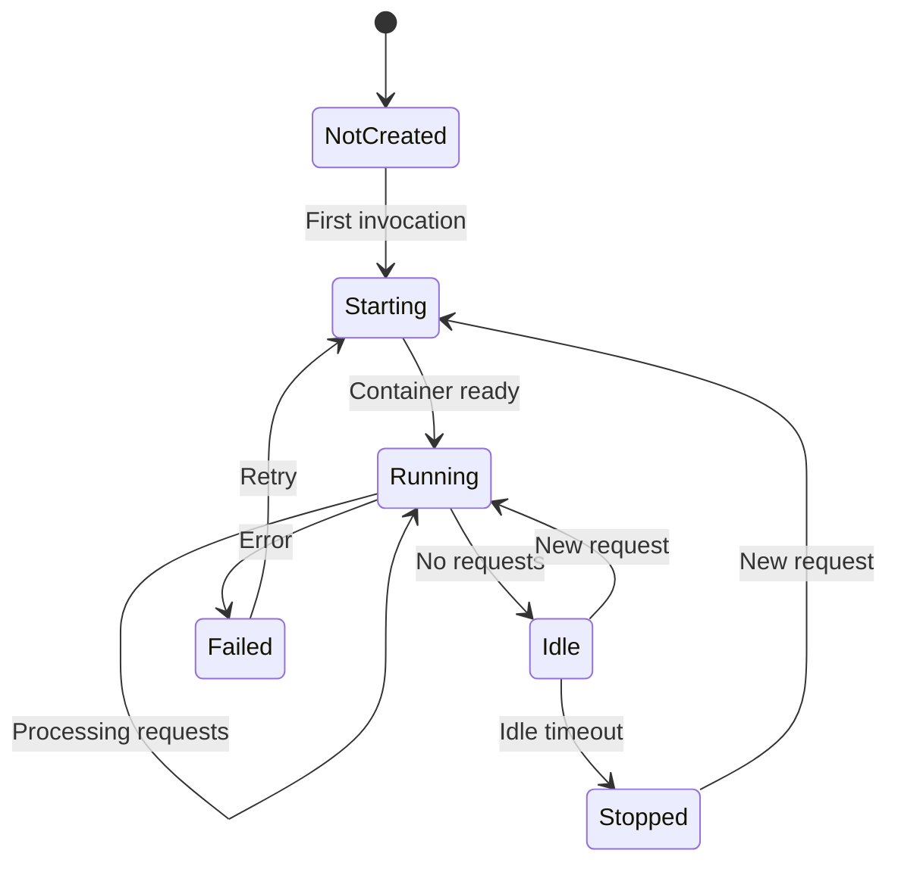

# Agent Deployments

Configure which agents are available in your AgentSystems platform. This page covers how to define agents, specify their container images, set resource limits, and manage their lifecycle.

## How Agent Deployment Works

Agents are defined in your configuration and deployed as Docker containers:



## Quick Start

Add an agent to your `agentsystems-config.yml`:

```yaml
agents:
  my-first-agent:
    # Container image to use
    image: "ghcr.io/agentsystems/hello-world:latest"

    # Display name
    name: "Hello World Agent"

    # Enable this agent
    enabled: true

    # Optional description
    description: "A simple agent for testing"

    # Models this agent can access
    models:
      - "gpt-4"
      - "claude-sonnet"
```

## Agent Configuration

### Minimal Configuration

The simplest agent definition requires just an image:

```yaml
agents:
  minimal-agent:
    image: "myorg/my-agent:v1.0.0"
```

### Complete Configuration

Full agent configuration with all options:

```yaml
agents:
  production-agent:
    # Container image (required)
    image: "ghcr.io/company/analyzer:v2.1.0"

    # Display information
    name: "Data Analyzer"
    description: "Analyzes CSV files and generates insights"
    enabled: true

    # Model access
    models:
      - "gpt-4"           # Primary model
      - "claude-sonnet"   # Fallback model
      - "llama-local"     # Local model for sensitive data

    # Resource limits
    resources:
      cpu: "2.0"          # CPU cores
      memory: "4Gi"       # Memory limit
      gpu: "1"            # GPU count (if available)

    # Egress allowlist - URLs the agent can access
    egress:
      - "api.datasource.com"
      - "*.googleapis.com"

    # Container settings
    container:
      # Environment variables
      env:
        LOG_LEVEL: "INFO"
        CACHE_SIZE: "1000"

      # Volume mounts
      volumes:
        - "/data/cache:/app/cache"
        - "/data/models:/app/models:ro"

      # Health check
      health_check:
        endpoint: "/health"
        interval: "30s"
        timeout: "5s"
        retries: 3

    # Scaling configuration
    scaling:
      min_instances: 0      # Scale to zero when idle
      max_instances: 5      # Maximum concurrent containers
      idle_timeout: "5m"    # Time before scaling down

    # Metadata
    tags:
      - "data-processing"
      - "production"
      - "gpu-enabled"

    # Execution settings
    execution:
      timeout: "30m"        # Maximum execution time
      max_retries: 2        # Retry failed invocations
      retry_delay: "10s"    # Delay between retries
```

## Common Configuration Patterns

### Multi-Model Agent

Configure an agent with multiple model options:

```yaml
agents:
  smart-assistant:
    image: "myorg/assistant:latest"
    models:
      # Models are tried in order
      - "gpt-4"            # Primary (powerful but expensive)
      - "gpt-3.5-turbo"    # Fallback (faster and cheaper)
      - "llama-local"      # Local fallback (free but slower)

    # Agent can choose model based on task
    env:
      MODEL_SELECTION_STRATEGY: "auto"
```

### Resource-Intensive Agent

For agents that need significant resources:

```yaml
agents:
  video-processor:
    image: "myorg/video-ai:latest"
    resources:
      cpu: "8.0"
      memory: "32Gi"
      gpu: "2"  # Requires GPU support

    execution:
      timeout: "2h"  # Long timeout for video processing

    scaling:
      max_instances: 2  # Limit concurrent instances
```

### Development vs Production

Use environment-specific configurations:

```yaml
agents:
  # Development version
  analyzer-dev:
    image: "myorg/analyzer:dev"
    enabled: true
    env:
      DEBUG: "true"
      LOG_LEVEL: "DEBUG"
    tags: ["development"]

  # Production version
  analyzer-prod:
    image: "myorg/analyzer:v1.2.3"
    enabled: true
    env:
      LOG_LEVEL: "ERROR"
      SENTRY_DSN: "${SENTRY_DSN}"
    resources:
      cpu: "4.0"
      memory: "8Gi"
    tags: ["production"]
```

## Agent Groups

Organize related agents using groups:

```yaml
agent_groups:
  data-processing:
    description: "Data processing pipeline agents"
    agents:
      - "csv-reader"
      - "data-transformer"
      - "report-generator"

  customer-service:
    description: "Customer interaction agents"
    agents:
      - "chat-bot"
      - "ticket-analyzer"
      - "sentiment-detector"

agents:
  csv-reader:
    image: "myorg/csv-reader:latest"
    # ... configuration

  data-transformer:
    image: "myorg/transformer:latest"
    # ... configuration
```

## Dynamic Agent Loading

Load agents from external sources:

### From Agent Hub

```yaml
agent_sources:
  - type: "agent-hub"
    repository: "agentsystems/community"
    agents:
      - "web-scraper@v1.0.0"
      - "pdf-analyzer@latest"
```

### From Private Registry

```yaml
agent_sources:
  - type: "registry"
    url: "https://registry.company.com"
    prefix: "ai-agents/"
    auto_discover: true
    filter:
      tags: ["production", "approved"]
```

## Lifecycle Management

### Container States



### Auto-scaling Behavior

```yaml
agents:
  scalable-agent:
    image: "myorg/agent:latest"

    scaling:
      # Minimum instances (0 = scale to zero)
      min_instances: 0

      # Maximum concurrent instances
      max_instances: 10

      # Scale up when queue > threshold
      scale_up_threshold: 5

      # Scale down after idle time
      idle_timeout: "5m"

      # Cooldown between scaling operations
      cooldown: "30s"
```

## Health Monitoring

Configure health checks for reliability:

```yaml
agents:
  monitored-agent:
    image: "myorg/agent:latest"

    container:
      health_check:
        # HTTP endpoint to check
        endpoint: "/health"

        # Expected status code
        expected_status: 200

        # Check frequency
        interval: "30s"

        # Request timeout
        timeout: "5s"

        # Failures before unhealthy
        retries: 3

        # Startup grace period
        start_period: "60s"
```

## Environment Variables

Pass configuration to agents via environment variables:

```yaml
agents:
  configured-agent:
    image: "myorg/agent:latest"

    container:
      env:
        # Static values
        APP_VERSION: "2.1.0"
        FEATURE_FLAGS: "new-ui,fast-mode"

        # Reference platform variables
        PLATFORM_URL: "${AGENTSYSTEMS_GATEWAY_URL}"

        # Reference secrets from .env
        API_KEY: "${EXTERNAL_API_KEY}"
        DATABASE_URL: "${DATABASE_CONNECTION_STRING}"

        # Computed values
        WORKER_THREADS: "4"
        CACHE_SIZE_MB: "512"
```

## Volume Mounts

Share data between host and containers:

```yaml
agents:
  data-agent:
    image: "myorg/agent:latest"

    container:
      volumes:
        # Read-write mount
        - "/host/data:/container/data"

        # Read-only mount
        - "/host/models:/container/models:ro"

        # Named volume
        - "agent-cache:/app/cache"

        # Temporary volume
        - "type=tmpfs,destination=/tmp,size=1G"
```

## Egress Allowlist

Control which external URLs your agents can access by specifying an egress allowlist:

```yaml
agents:
  restricted-agent:
    image: "myorg/agent:latest"

    # List of URLs the agent is allowed to access
    egress:
      - "api.openai.com"
      - "api.anthropic.com"
      - "*.amazonaws.com"  # Wildcard subdomain
      - "github.com"
      - "pypi.org"
```

<Info>
  The egress allowlist helps prevent agents from accessing unauthorized external services. Only URLs listed here will be accessible to the agent container.
</Info>

### Common Egress Patterns

```yaml
# For AI agents
egress:
  - "api.openai.com"
  - "api.anthropic.com"
  - "*.pinecone.io"  # Vector database

# For data processing
egress:
  - "*.s3.amazonaws.com"
  - "storage.googleapis.com"
  - "*.blob.core.windows.net"

# For development tools
egress:
  - "github.com"
  - "api.github.com"
  - "pypi.org"
  - "npmjs.org"
```

## Validation and Testing

<Tabs>
  <Tab title="Validate Configuration">
    ```bash
    # Validate agent configuration
    agentsystems validate agents

    # Check specific agent
    agentsystems validate agent my-agent

    # Dry run deployment
    agentsystems deploy --dry-run
    ```
  </Tab>

  <Tab title="Test Agent">
    ```bash
    # Test agent health check
    agentsystems test agent my-agent --health

    # Test agent invocation
    agentsystems test agent my-agent --invoke

    # Test with sample data
    agentsystems test agent my-agent --sample-data
    ```
  </Tab>

  <Tab title="Monitor Agent">
    ```bash
    # View agent status
    agentsystems status agents

    # View agent logs
    agentsystems logs my-agent

    # View agent metrics
    agentsystems metrics my-agent
    ```
  </Tab>
</Tabs>

## Best Practices

<AccordionGroup>
  <Accordion title="Image Management" icon="box">
    - Use specific version tags, not `latest`
    - Sign and scan images for security
    - Keep images small and focused
    - Use multi-stage builds to reduce size
    - Cache commonly used base images
  </Accordion>

  <Accordion title="Resource Planning" icon="microchip">
    - Start with conservative resource limits
    - Monitor actual usage and adjust
    - Use horizontal scaling over vertical
    - Set appropriate idle timeouts
    - Consider cost vs performance tradeoffs
  </Accordion>

  <Accordion title="Security Configuration" icon="shield">
    - Limit egress to required URLs only
    - Never hardcode secrets in configuration
    - Use read-only mounts where possible
    - Run containers as non-root users
    - Keep egress allowlist minimal
  </Accordion>

  <Accordion title="Operational Excellence" icon="chart-line">
    - Always configure health checks
    - Set appropriate timeouts
    - Implement proper logging
    - Use tags for organization
    - Document agent purposes
  </Accordion>
</AccordionGroup>

## Troubleshooting

<AccordionGroup>
  <Accordion title="Agent won't start">
    **Check these common issues:**
    - Image exists and is accessible
    - Registry authentication is configured
    - Resource limits aren't too restrictive
    - Health check endpoint is correct
    - Required environment variables are set
  </Accordion>

  <Accordion title="Agent crashes immediately">
    **Debugging steps:**
    ```bash
    # Check logs
    agentsystems logs my-agent

    # Check events
    agentsystems events my-agent

    # Run interactively
    docker run -it image-name /bin/sh
    ```
  </Accordion>

  <Accordion title="Model access denied">
    **Verify:**
    - Model is listed in agent's `models` array
    - Model connection is configured
    - API keys are valid
    - Model ID matches exactly
  </Accordion>

  <Accordion title="Network connectivity issues">
    **Solutions:**
    - Check URL is in agent's egress allowlist
    - Verify exact URL format matches (with/without https://)
    - Test DNS resolution
    - Check if wildcards are needed (*.domain.com)
  </Accordion>
</AccordionGroup>

## Example: Complete Production Agent

Here's a production-ready agent configuration:

```yaml
agents:
  document-processor:
    # Versioned image from private registry
    image: "ghcr.io/company/doc-processor:v3.2.1"

    # Descriptive information
    name: "Document Processing Engine"
    description: "Processes PDFs, extracts data, generates summaries"
    enabled: true

    # Model configuration
    models:
      - "gpt-4"          # For complex analysis
      - "gpt-3.5-turbo"  # For simple extraction

    # Resource allocation
    resources:
      cpu: "2.0"
      memory: "4Gi"

    # Egress allowlist
    egress:
      - "api.openai.com"
      - "storage.googleapis.com"
      - "sentry.io"

    # Container configuration
    container:
      env:
        LOG_LEVEL: "${LOG_LEVEL:-INFO}"
        SENTRY_DSN: "${SENTRY_DSN}"
        CACHE_ENABLED: "true"

      volumes:
        - "document-cache:/app/cache"

      health_check:
        endpoint: "/health"
        interval: "30s"
        timeout: "5s"

    # Auto-scaling
    scaling:
      min_instances: 1
      max_instances: 10
      idle_timeout: "10m"

    # Execution limits
    execution:
      timeout: "15m"
      max_retries: 1

    # Metadata
    tags:
      - "production"
      - "document-processing"
      - "gpu-optional"
```

## Next Steps

<CardGroup cols={2}>
  <Card title="Run Agents" icon="play" href="/user-guide/running-agents">
    Execute configured agents
  </Card>

  <Card title="Build Agents" icon="hammer" href="/build-agents">
    Create custom agents
  </Card>
</CardGroup>
