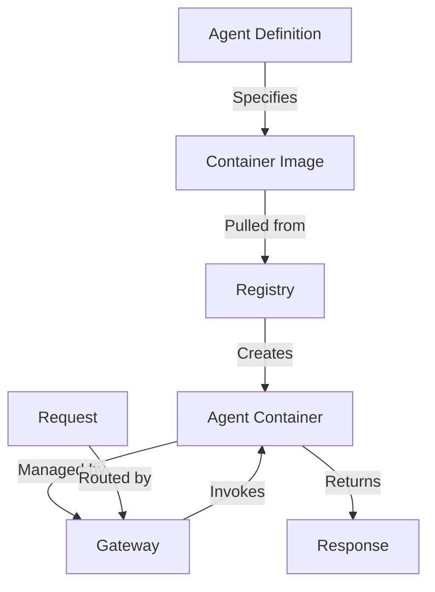
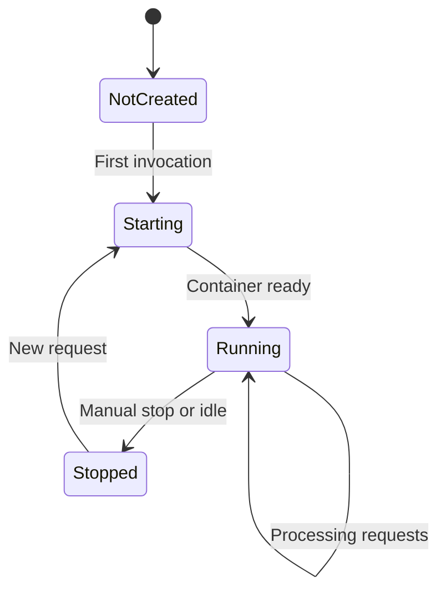

# Agent Deployments

Configure which agents are available in your AgentSystems platform. This page covers how to define agents, specify their container images, set resource limits, and manage their lifecycle.

## How Agent Deployment Works

Agents are defined in your configuration and deployed as Docker containers:



## Quick Start

Add an agent to your `agentsystems-config.yml`:

```yaml
agents:
  - name: my-first-agent
    repo: agentsystems/hello-world-agent
    tag: latest
    registry_connection: agentsystems_public
    egress_allowlist:
      - https://api.example.com
    labels:
      agent.port: '8000'
    overrides:
      expose:
        - '8000'
```

## Agent Configuration

### Minimal Configuration

The simplest agent definition:

```yaml
agents:
  - name: minimal-agent
    repo: myorg/my-agent
    tag: v1.0.0
    registry_connection: dockerhub
```

### Complete Configuration

Full agent configuration with available options:

```yaml
agents:
  - name: production-agent
    # Docker image repository
    repo: ghcr.io/company/analyzer

    # Image tag
    tag: v2.1.0

    # Registry connection to use
    registry_connection: ghcr

    # Egress allowlist - URLs the agent can access
    egress_allowlist:
      - https://api.datasource.com
      - https://storage.googleapis.com

    # Docker labels
    labels:
      agent.port: '8000'
      environment: 'production'

    # Docker compose overrides
    overrides:
      expose:
        - '8000'
      environment:
        LOG_LEVEL: INFO
        CACHE_SIZE: '1000'
      volumes:
        - /data/cache:/app/cache
        - /data/models:/app/models:ro
```

## Common Configuration Patterns

### Multiple Agents

Define multiple agents in your configuration:

```yaml
agents:
  - name: data-processor
    repo: myorg/data-processor
    tag: latest
    registry_connection: dockerhub
    egress_allowlist:
      - https://api.datasource.com

  - name: report-generator
    repo: myorg/report-generator
    tag: v1.2.3
    registry_connection: dockerhub
    egress_allowlist:
      - https://storage.googleapis.com

  - name: web-scraper
    repo: myorg/scraper
    tag: latest
    registry_connection: dockerhub
    egress_allowlist:
      - https://example.com
      - https://news.site.com
```

### Environment Variables

Pass environment variables to agents:

```yaml
agents:
  - name: my-agent
    repo: myorg/my-agent
    tag: latest
    registry_connection: dockerhub
    overrides:
      environment:
        LOG_LEVEL: INFO
        API_KEY: ${API_KEY}  # Reference from .env
        DEBUG: 'false'
```


## Container Lifecycle

AgentSystems manages agent containers automatically:



**Key points:**
- Containers start on first request
- Containers may stop when idle to save resources
- Containers restart automatically when needed

## Docker Overrides

Customize container behavior using Docker Compose overrides:

```yaml
agents:
  - name: custom-agent
    repo: myorg/agent
    tag: latest
    registry_connection: dockerhub

    overrides:
      # Environment variables
      environment:
        LOG_LEVEL: INFO
        API_KEY: ${EXTERNAL_API_KEY}  # From .env

      # Volume mounts
      volumes:
        - /host/data:/container/data
        - /host/models:/container/models:ro

      # Expose ports
      expose:
        - '8080'
        - '9090'

      # Other Docker Compose settings
      restart: unless-stopped
      mem_limit: 4g
```

## Egress Allowlist

Control which external URLs your agents can access by specifying an egress allowlist:

```yaml
agents:
  restricted-agent:
    image: "myorg/agent:latest"

    # List of URLs the agent is allowed to access
    egress:
      - "api.openai.com"
      - "api.anthropic.com"
      - "*.amazonaws.com"  # Wildcard subdomain
      - "github.com"
      - "pypi.org"
```

<Info>
  The egress allowlist helps prevent agents from accessing unauthorized external services. Only URLs listed here will be accessible to the agent container.
</Info>

### Common Egress Patterns

```yaml
# For AI agents
egress:
  - "api.openai.com"
  - "api.anthropic.com"
  - "*.pinecone.io"  # Vector database

# For data processing
egress:
  - "*.s3.amazonaws.com"
  - "storage.googleapis.com"
  - "*.blob.core.windows.net"

# For development tools
egress:
  - "github.com"
  - "api.github.com"
  - "pypi.org"
  - "npmjs.org"
```

## Testing Your Configuration

<Tabs>
  <Tab title="Run Agent">
    ```bash
    # Run an agent
    agentsystems run my-agent

    # Run with input data
    agentsystems run my-agent --input "Hello, world!"
    ```
  </Tab>

  <Tab title="Monitor Agent">
    ```bash
    # View platform status
    agentsystems status

    # View logs for all services
    agentsystems logs

    # View logs for specific service
    agentsystems logs gateway
    ```
  </Tab>
</Tabs>

## Best Practices

<AccordionGroup>
  <Accordion title="Image Management" icon="box">
    - Use specific version tags, not `latest`
    - Sign and scan images for security
    - Keep images small and focused
    - Use multi-stage builds to reduce size
    - Cache commonly used base images
  </Accordion>

  <Accordion title="Resource Planning" icon="microchip">
    - Start with conservative resource limits
    - Monitor actual usage and adjust
    - Use horizontal scaling over vertical
    - Set appropriate idle timeouts
    - Consider cost vs performance tradeoffs
  </Accordion>

  <Accordion title="Security Configuration" icon="shield">
    - Limit egress to required URLs only
    - Never hardcode secrets in configuration
    - Use read-only mounts where possible
    - Run containers as non-root users
    - Keep egress allowlist minimal
  </Accordion>

  <Accordion title="Operational Excellence" icon="chart-line">
    - Always configure health checks
    - Set appropriate timeouts
    - Implement proper logging
    - Use tags for organization
    - Document agent purposes
  </Accordion>
</AccordionGroup>

## Troubleshooting

<AccordionGroup>
  <Accordion title="Agent won't start">
    **Check these common issues:**
    - Image exists and is accessible
    - Registry authentication is configured
    - Resource limits aren't too restrictive
    - Health check endpoint is correct
    - Required environment variables are set
  </Accordion>

  <Accordion title="Agent crashes immediately">
    **Debugging steps:**
    ```bash
    # Check logs
    agentsystems logs

    # Run interactively to debug
    docker run -it image-name /bin/sh
    ```
  </Accordion>

  <Accordion title="Model access denied">
    **Verify:**
    - Model is listed in agent's `models` array
    - Model connection is configured
    - API keys are valid
    - Model ID matches exactly
  </Accordion>

  <Accordion title="Network connectivity issues">
    **Solutions:**
    - Check URL is in agent's egress allowlist
    - Verify exact URL format matches (with/without https://)
    - Test DNS resolution
    - Check if wildcards are needed (*.domain.com)
  </Accordion>
</AccordionGroup>

## Example: Complete Production Agent

Here's a production-ready agent configuration:

```yaml
agents:
  - name: document-processor
    # Docker repository
    repo: ghcr.io/company/doc-processor

    # Specific version tag
    tag: v3.2.1

    # Registry connection
    registry_connection: ghcr

    # Egress allowlist
    egress_allowlist:
      - https://api.openai.com
      - https://storage.googleapis.com
      - https://sentry.io

    # Docker labels
    labels:
      agent.port: '8000'
      environment: 'production'
      team: 'data-processing'

    # Docker overrides
    overrides:
      expose:
        - '8000'

      environment:
        LOG_LEVEL: ${LOG_LEVEL:-INFO}
        SENTRY_DSN: ${SENTRY_DSN}
        CACHE_ENABLED: 'true'

      volumes:
        - document-cache:/app/cache

      restart: unless-stopped
      mem_limit: 4g
```

## Next Steps

<CardGroup cols={2}>
  <Card title="Run Agents" icon="play" href="/user-guide/running-agents">
    Execute configured agents
  </Card>

  <Card title="Build Agents" icon="hammer" href="/build-agents">
    Create custom agents
  </Card>
</CardGroup>
