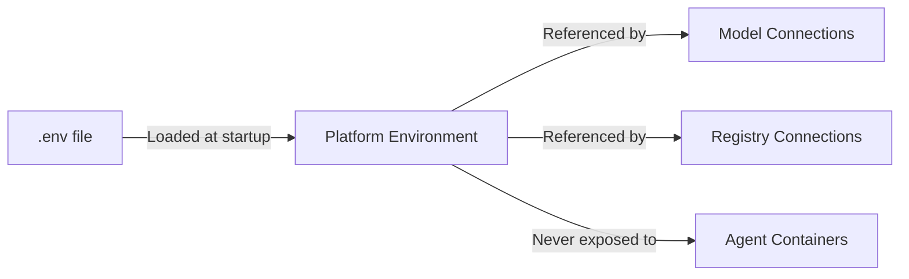
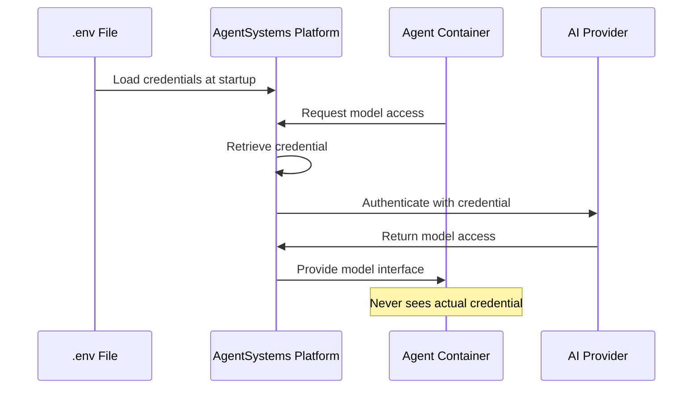

# API Keys & Credentials

Credentials are the foundation of your AgentSystems configuration. This page covers how to securely manage API keys, tokens, and other sensitive information needed by model providers and container registries.

<Warning>
  Never commit credentials to version control. Always use environment variables stored in `.env` files that are excluded from git.
</Warning>

## How Credentials Work

AgentSystems uses environment variables to manage sensitive information:



Key principles:
- Credentials are stored in `.env` files
- The platform loads these at startup
- Configuration files reference environment variable names, not values
- Agents never see credentials directly

## Setting Up Credentials

<Steps>
  <Step title="Locate your .env file">
    After running `agentsystems init`, you'll have a `.env` file in your deployment directory:

    ```bash
    my-deployment/
    ├── .env                  # Your credentials go here
    ├── .env.example          # Template showing required variables
    └── agentsystems-config.yml
    ```
  </Step>

  <Step title="Add your credentials">
    Edit the `.env` file to add your API keys:

    ```bash
    # AI Model Provider Credentials
    OPENAI_API_KEY=sk-proj-...
    ANTHROPIC_API_KEY=sk-ant-api03-...

    # AWS Credentials (for Bedrock)
    AWS_ACCESS_KEY_ID=AKIA...
    AWS_SECRET_ACCESS_KEY=...
    AWS_DEFAULT_REGION=us-east-1

    # Container Registry Credentials
    DOCKERHUB_USERNAME=yourusername
    DOCKERHUB_TOKEN=dckr_pat_...
    GITHUB_TOKEN=ghp_...

    # Platform Authentication
    AGENTSYSTEMS_BEARER_TOKEN=your-secret-token
    ```
  </Step>

  <Step title="Verify file permissions">
    Ensure your `.env` file is protected:

    ```bash
    # Check permissions
    ls -la .env

    # Should show: -rw------- (600) or -rw-r----- (640)
    # If not, fix with:
    chmod 600 .env
    ```
  </Step>

  <Step title="Test credential loading">
    Verify credentials are loaded correctly:

    ```bash
    # Restart platform to load new credentials
    agentsystems restart

    # Check logs for any credential errors
    agentsystems logs gateway | grep -i "credential\|auth"
    ```
  </Step>
</Steps>

## Types of Credentials

### AI Model Providers

<Tabs>
  <Tab title="OpenAI">
    ```bash
    # Required for OpenAI models
    OPENAI_API_KEY=sk-proj-...

    # Optional: Organization ID
    OPENAI_ORG_ID=org-...
    ```

    Get your key from: [platform.openai.com/api-keys](https://platform.openai.com/api-keys)
  </Tab>

  <Tab title="Anthropic">
    ```bash
    # Required for Claude models
    ANTHROPIC_API_KEY=sk-ant-api03-...
    ```

    Get your key from: [console.anthropic.com](https://console.anthropic.com/)
  </Tab>

  <Tab title="AWS Bedrock">
    ```bash
    # Required for Bedrock models
    AWS_ACCESS_KEY_ID=AKIA...
    AWS_SECRET_ACCESS_KEY=...
    AWS_DEFAULT_REGION=us-east-1

    # Optional: Session token for temporary credentials
    AWS_SESSION_TOKEN=...
    ```

    Configure in AWS IAM Console with Bedrock permissions
  </Tab>

  <Tab title="Azure OpenAI">
    ```bash
    # Required for Azure OpenAI
    AZURE_OPENAI_API_KEY=...
    AZURE_OPENAI_ENDPOINT=https://your-resource.openai.azure.com/
    AZURE_OPENAI_API_VERSION=2024-02-01
    ```

    Get from Azure Portal → Azure OpenAI resource
  </Tab>
</Tabs>

### Container Registries

<Tabs>
  <Tab title="Docker Hub">
    ```bash
    # For private Docker Hub repositories
    DOCKERHUB_USERNAME=yourusername
    DOCKERHUB_TOKEN=dckr_pat_...
    ```

    Create token at: [hub.docker.com/settings/security](https://hub.docker.com/settings/security)
  </Tab>

  <Tab title="GitHub Container Registry">
    ```bash
    # For GitHub Container Registry (ghcr.io)
    GITHUB_USERNAME=yourusername
    GITHUB_TOKEN=ghp_...
    ```

    Create token with `read:packages` scope at: [github.com/settings/tokens](https://github.com/settings/tokens)
  </Tab>

  <Tab title="AWS ECR">
    ```bash
    # Uses same AWS credentials
    AWS_ACCESS_KEY_ID=AKIA...
    AWS_SECRET_ACCESS_KEY=...
    AWS_DEFAULT_REGION=us-east-1
    ```

    Requires ECR permissions in IAM
  </Tab>

  <Tab title="Private Registry">
    ```bash
    # For custom/private registries
    PRIVATE_REGISTRY_URL=registry.company.com
    PRIVATE_REGISTRY_USERNAME=username
    PRIVATE_REGISTRY_PASSWORD=password
    ```
  </Tab>
</Tabs>

### Platform Authentication

```bash
# Bearer token for API access (optional but recommended)
AGENTSYSTEMS_BEARER_TOKEN=generate-a-secure-random-token-here

# Keycloak integration (future)
KEYCLOAK_URL=https://auth.example.com
KEYCLOAK_REALM=agentsystems
KEYCLOAK_CLIENT_ID=agentsystems-client
KEYCLOAK_CLIENT_SECRET=...
```

## Best Practices

<AccordionGroup>
  <Accordion title="Generate Strong Tokens" icon="key">
    Use strong, random tokens for authentication:

    ```bash
    # Generate a secure random token
    openssl rand -hex 32

    # Or using Python
    python -c "import secrets; print(secrets.token_hex(32))"
    ```
  </Accordion>

  <Accordion title="Rotate Credentials Regularly" icon="rotate">
    - Set calendar reminders to rotate API keys
    - Use different keys for development/production
    - Revoke unused keys immediately
    - Monitor for exposed credentials in logs
  </Accordion>

  <Accordion title="Use Least Privilege" icon="shield-halved">
    - Create API keys with minimal required permissions
    - Use read-only tokens where possible
    - Separate credentials by function (models vs registries)
    - Avoid using personal access tokens in production
  </Accordion>

  <Accordion title="Secure Storage" icon="lock">
    - Never store credentials in code
    - Use `.gitignore` to exclude `.env` files
    - Consider using secret management tools in production
    - Encrypt `.env` files at rest if possible
  </Accordion>
</AccordionGroup>

## Environment Variable Reference

Commonly used environment variables:

| Variable | Purpose | Required |
|----------|---------|----------|
| `OPENAI_API_KEY` | OpenAI API access | If using OpenAI |
| `ANTHROPIC_API_KEY` | Anthropic API access | If using Claude |
| `AWS_ACCESS_KEY_ID` | AWS services access | If using Bedrock/ECR |
| `AWS_SECRET_ACCESS_KEY` | AWS services secret | If using Bedrock/ECR |
| `DOCKERHUB_USERNAME` | Docker Hub login | If using private images |
| `DOCKERHUB_TOKEN` | Docker Hub authentication | If using private images |
| `GITHUB_TOKEN` | GitHub packages access | If using ghcr.io |
| `AGENTSYSTEMS_BEARER_TOKEN` | API authentication | Recommended |

## Troubleshooting

<AccordionGroup>
  <Accordion title="Credentials not loading">
    - Verify `.env` file is in the deployment directory
    - Check file has correct format (KEY=value, no spaces around =)
    - Restart platform after adding credentials
    - Check logs for parsing errors
  </Accordion>

  <Accordion title="Authentication failures">
    - Verify API key is active and not expired
    - Check you're using the correct environment variable name
    - Ensure no extra spaces or quotes in values
    - Test credentials directly with provider's API
  </Accordion>

  <Accordion title="Permission denied errors">
    - Check API key has required permissions
    - Verify account has access to requested resources
    - For registries, ensure token has `pull` permissions
    - For AWS, check IAM policies
  </Accordion>

  <Accordion title="Credentials exposed in logs">
    - Review logging configuration
    - Never log environment variables directly
    - Mask sensitive values in error messages
    - Report security issues immediately
  </Accordion>
</AccordionGroup>

## Security Considerations

<Warning>
  **Critical Security Points:**
  - Credentials in `.env` are loaded into the platform's environment
  - Agents cannot access these environment variables directly
  - The platform uses credentials on behalf of agents
  - Never pass credentials as agent parameters
</Warning>

### Credential Flow



## Next Steps

Now that credentials are configured:

<CardGroup cols={3}>
  <Card title="Registry Setup" icon="package" href="/configuration/registries">
    Configure container registries
  </Card>

  <Card title="Model Setup" icon="brain" href="/configuration/models">
    Connect AI model providers
  </Card>

  <Card title="Deploy Agents" icon="rocket" href="/configuration/agents">
    Configure agent deployments
  </Card>
</CardGroup>