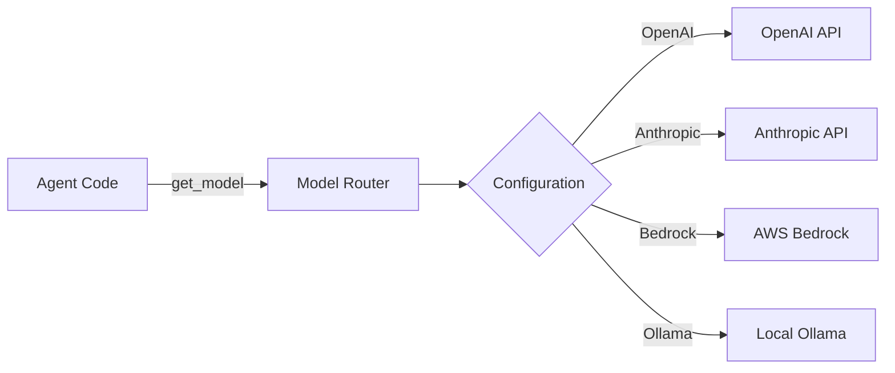

# AI Model Connections

Configure connections to AI model providers like OpenAI, Anthropic, AWS Bedrock, and Ollama. AgentSystems uses abstract model routing, allowing agents to access models without managing credentials directly.

## How Model Routing Works

AgentSystems provides a unified interface for accessing AI models:



Agents request models by abstract ID (e.g., `gpt-4`, `claude-sonnet`), and the platform routes to the configured provider.

## Quick Setup

<Tabs>
  <Tab title="OpenAI">
    <Steps>
      <Step title="Get your API key">
        Visit [OpenAI API Keys](https://platform.openai.com/api-keys) to create a key
      </Step>

      <Step title="Add to .env file">
        ```bash
        OPENAI_API_KEY=sk-...
        ```
      </Step>

      <Step title="Configure model in agentsystems-config.yml">
        ```yaml
        model_connections:
          gpt-4:
            hosting_provider: "openai"
            hosting_provider_model_id: "gpt-4-turbo-preview"
            enabled: true
            auth:
              method: "api_key"
              api_key_env: "OPENAI_API_KEY"
        ```
      </Step>
    </Steps>
  </Tab>

  <Tab title="Anthropic">
    <Steps>
      <Step title="Get your API key">
        Visit [Anthropic Console](https://console.anthropic.com/) to create a key
      </Step>

      <Step title="Add to .env file">
        ```bash
        ANTHROPIC_API_KEY=sk-ant-...
        ```
      </Step>

      <Step title="Configure model in agentsystems-config.yml">
        ```yaml
        model_connections:
          claude-sonnet:
            hosting_provider: "anthropic"
            hosting_provider_model_id: "claude-3-5-sonnet-20241022"
            enabled: true
            auth:
              method: "api_key"
              api_key_env: "ANTHROPIC_API_KEY"
        ```
      </Step>
    </Steps>
  </Tab>

  <Tab title="Ollama (Local)">
    <Steps>
      <Step title="Install Ollama">
        Download from [ollama.ai](https://ollama.ai) and install
      </Step>

      <Step title="Pull a model">
        ```bash
        ollama pull llama3.2
        ```
      </Step>

      <Step title="Configure in agentsystems-config.yml">
        ```yaml
        model_connections:
          llama3:
            hosting_provider: "ollama"
            hosting_provider_model_id: "llama3.2"
            enabled: true
            base_url: "http://host.docker.internal:11434"  # For Docker on Mac/Windows
            # base_url: "http://172.17.0.1:11434"  # For Docker on Linux
        ```
      </Step>
    </Steps>
  </Tab>

  <Tab title="AWS Bedrock">
    <Steps>
      <Step title="Configure AWS credentials">
        ```bash
        AWS_ACCESS_KEY_ID=AKIA...
        AWS_SECRET_ACCESS_KEY=...
        AWS_DEFAULT_REGION=us-east-1
        ```
      </Step>

      <Step title="Enable model access in AWS">
        Ensure your AWS account has access to Bedrock models
      </Step>

      <Step title="Configure in agentsystems-config.yml">
        ```yaml
        model_connections:
          claude-bedrock:
            hosting_provider: "bedrock"
            hosting_provider_model_id: "anthropic.claude-3-sonnet-20240229-v1:0"
            enabled: true
            aws_region: "us-east-1"
            auth:
              method: "aws_credentials"
              access_key_env: "AWS_ACCESS_KEY_ID"
              secret_key_env: "AWS_SECRET_ACCESS_KEY"
        ```
      </Step>
    </Steps>
  </Tab>
</Tabs>

## Configuration File Structure

Model connections are defined in `agentsystems-config.yml`:

```yaml
config_version: 1

model_connections:
  # Abstract model ID used by agents
  gpt-4:
    # Provider that hosts the model
    hosting_provider: "openai"

    # Provider-specific model identifier
    hosting_provider_model_id: "gpt-4-turbo-preview"

    # Enable/disable this connection
    enabled: true

    # Authentication configuration
    auth:
      method: "api_key"  # api_key, aws_credentials, or none
      api_key_env: "OPENAI_API_KEY"  # Environment variable name

    # Optional provider-specific settings
    temperature: 0.7
    max_tokens: 4096

  # Multiple models can be configured
  claude-sonnet:
    hosting_provider: "anthropic"
    hosting_provider_model_id: "claude-3-5-sonnet-20241022"
    enabled: true
    auth:
      method: "api_key"
      api_key_env: "ANTHROPIC_API_KEY"
```

## Provider Details

### OpenAI

<AccordionGroup>
  <Accordion title="Supported Models">
    - `gpt-4-turbo-preview`
    - `gpt-4`
    - `gpt-3.5-turbo`
    - Custom fine-tuned models
  </Accordion>

  <Accordion title="Configuration Options">
    ```yaml
    auth:
      method: "api_key"
      api_key_env: "OPENAI_API_KEY"

    # Optional settings
    temperature: 0.7
    max_tokens: 4096
    organization_id: "org-..."  # If using org-specific key
    ```
  </Accordion>

  <Accordion title="Cost Considerations">
    - Charged per token (input/output)
    - GPT-4 is more expensive than GPT-3.5
    - Monitor usage in OpenAI dashboard
  </Accordion>
</AccordionGroup>

### Anthropic

<AccordionGroup>
  <Accordion title="Supported Models">
    - `claude-3-5-sonnet-20241022` (latest)
    - `claude-3-opus-20240229`
    - `claude-3-sonnet-20240229`
    - `claude-3-haiku-20240307`
  </Accordion>

  <Accordion title="Configuration Options">
    ```yaml
    auth:
      method: "api_key"
      api_key_env: "ANTHROPIC_API_KEY"

    # Optional settings
    temperature: 0.7
    max_tokens: 4096
    ```
  </Accordion>

  <Accordion title="Cost Considerations">
    - Charged per token
    - Opus > Sonnet > Haiku in cost
    - Check current pricing on Anthropic's website
  </Accordion>
</AccordionGroup>

### Ollama (Local Models)

<AccordionGroup>
  <Accordion title="Supported Models">
    - `llama3.2` (various sizes)
    - `mistral`
    - `mixtral`
    - `codellama`
    - Any model from [Ollama Library](https://ollama.ai/library)
  </Accordion>

  <Accordion title="Configuration Options">
    ```yaml
    hosting_provider: "ollama"
    base_url: "http://host.docker.internal:11434"  # Mac/Windows
    # base_url: "http://172.17.0.1:11434"  # Linux

    # No authentication needed for local models
    ```
  </Accordion>

  <Accordion title="Resource Requirements">
    - Requires local GPU for good performance (optional)
    - Models range from 3GB to 40GB+ disk space
    - CPU-only mode available but slower
  </Accordion>
</AccordionGroup>

### AWS Bedrock

<AccordionGroup>
  <Accordion title="Supported Models">
    - Anthropic Claude models
    - Amazon Titan models
    - Meta Llama models
    - Cohere models
    - Stability AI models
  </Accordion>

  <Accordion title="Configuration Options">
    ```yaml
    auth:
      method: "aws_credentials"
      access_key_env: "AWS_ACCESS_KEY_ID"
      secret_key_env: "AWS_SECRET_ACCESS_KEY"

    aws_region: "us-east-1"

    # Optional settings
    temperature: 0.7
    max_tokens: 4096
    ```
  </Accordion>

  <Accordion title="Setup Requirements">
    - AWS account with Bedrock access
    - Model access must be requested in AWS Console
    - IAM permissions for Bedrock
  </Accordion>
</AccordionGroup>

## Using Multiple Providers

You can configure multiple providers simultaneously:

```yaml
model_connections:
  # Fast, cheap model for simple tasks
  gpt-3.5:
    hosting_provider: "openai"
    hosting_provider_model_id: "gpt-3.5-turbo"
    enabled: true
    auth:
      api_key_env: "OPENAI_API_KEY"

  # Powerful model for complex tasks
  claude-opus:
    hosting_provider: "anthropic"
    hosting_provider_model_id: "claude-3-opus-20240229"
    enabled: true
    auth:
      api_key_env: "ANTHROPIC_API_KEY"

  # Local model for privacy-sensitive tasks
  llama-local:
    hosting_provider: "ollama"
    hosting_provider_model_id: "llama3.2:70b"
    enabled: true
    base_url: "http://host.docker.internal:11434"
```

## Testing Your Configuration

After configuring models, test them:

<Tabs>
  <Tab title="Using CLI">
    ```bash
    # Test with hello-world agent
    agentsystems run hello-world-agent

    # Or test a specific model
    agentsystems run test-model --model gpt-4
    ```
  </Tab>

  <Tab title="Using Web UI">
    1. Navigate to Configuration → Model Connections
    2. Click "Test Connection" next to your model
    3. View the test results
  </Tab>

  <Tab title="Using API">
    ```bash
    curl -X POST http://localhost:18080/invoke/hello-world-agent \
      -H "Content-Type: application/json" \
      -d '{"model": "gpt-4"}'
    ```
  </Tab>
</Tabs>

## Troubleshooting

<AccordionGroup>
  <Accordion title="Model not found error">
    - Verify the model ID in your configuration matches exactly
    - Check that `enabled: true` is set
    - Ensure the model is available in your provider account
  </Accordion>

  <Accordion title="Authentication failed">
    - Verify API key is correctly set in `.env` file
    - Check environment variable name matches configuration
    - Ensure API key has necessary permissions
  </Accordion>

  <Accordion title="Ollama connection refused">
    - Verify Ollama is running: `ollama list`
    - Check the base_url matches your Docker setup
    - For Docker Desktop: use `host.docker.internal`
    - For Linux: use Docker bridge IP (usually `172.17.0.1`)
  </Accordion>

  <Accordion title="Bedrock access denied">
    - Verify AWS credentials are correct
    - Check IAM permissions include Bedrock access
    - Ensure model access is enabled in AWS Console
    - Verify region matches where models are available
  </Accordion>
</AccordionGroup>

## Best Practices

<CardGroup cols={2}>
  <Card title="Security" icon="shield">
    - Never commit API keys to version control
    - Use environment variables for all credentials
    - Rotate API keys regularly
    - Monitor usage for anomalies
  </Card>

  <Card title="Performance" icon="gauge">
    - Use appropriate models for tasks (don't use GPT-4 for simple tasks)
    - Configure temperature and max_tokens appropriately
    - Consider local models for high-volume tasks
    - Cache responses when possible
  </Card>

  <Card title="Cost Management" icon="dollar-sign">
    - Set up usage alerts with providers
    - Use cheaper models for development/testing
    - Monitor token usage in agent logs
    - Consider local models for frequent tasks
  </Card>

  <Card title="Reliability" icon="check-circle">
    - Configure fallback models
    - Handle rate limits gracefully
    - Test configurations before production
    - Keep provider SDKs updated
  </Card>
</CardGroup>

## Next Steps

<CardGroup cols={3}>
  <Card title="Configure Credentials" icon="key" href="/configuration/credentials">
    Set up additional API keys and tokens
  </Card>

  <Card title="Deploy Agents" icon="rocket" href="/configuration/agents">
    Configure which agents to deploy
  </Card>

  <Card title="Run Your First Agent" icon="play" href="/user-guide/running-agents">
    Start using configured models
  </Card>
</CardGroup>