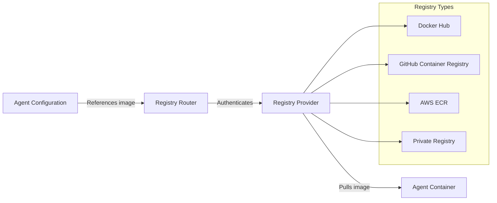

# Container Registries

Configure access to container registries where agent images are stored. AgentSystems supports both public and private registries, allowing you to deploy agents from various sources.

## How Registry Connections Work

AgentSystems pulls agent container images from configured registries:



## Quick Setup

<Tabs>
  <Tab title="Docker Hub">
    For public images, no authentication is needed. For private repositories:

    <Steps>
      <Step title="Create an access token">
        Visit [Docker Hub Security Settings](https://hub.docker.com/settings/security) and create a new access token
      </Step>

      <Step title="Add credentials to .env">
        ```bash
        DOCKERHUB_USERNAME=yourusername
        DOCKERHUB_TOKEN=dckr_pat_...
        ```
      </Step>

      <Step title="Configure in agentsystems-config.yml">
        ```yaml
        registries:
          dockerhub:
            url: "https://registry-1.docker.io"
            type: "dockerhub"
            auth:
              method: "basic"
              username_env: "DOCKERHUB_USERNAME"
              password_env: "DOCKERHUB_TOKEN"
        ```
      </Step>
    </Steps>
  </Tab>

  <Tab title="GitHub Container Registry">
    <Steps>
      <Step title="Generate a PAT token">
        Create a token at [GitHub Settings](https://github.com/settings/tokens) with `read:packages` scope
      </Step>

      <Step title="Add credentials to .env">
        ```bash
        GITHUB_USERNAME=yourusername
        GITHUB_TOKEN=ghp_...
        ```
      </Step>

      <Step title="Configure in agentsystems-config.yml">
        ```yaml
        registries:
          ghcr:
            url: "https://ghcr.io"
            type: "ghcr"
            auth:
              method: "basic"
              username_env: "GITHUB_USERNAME"
              password_env: "GITHUB_TOKEN"
        ```
      </Step>
    </Steps>
  </Tab>

  <Tab title="AWS ECR">
    <Steps>
      <Step title="Set up AWS credentials">
        Ensure AWS credentials are configured in `.env`:
        ```bash
        AWS_ACCESS_KEY_ID=AKIA...
        AWS_SECRET_ACCESS_KEY=...
        AWS_DEFAULT_REGION=us-east-1
        ```
      </Step>

      <Step title="Configure in agentsystems-config.yml">
        ```yaml
        registries:
          ecr:
            url: "123456789012.dkr.ecr.us-east-1.amazonaws.com"
            type: "ecr"
            auth:
              method: "aws"
              region: "us-east-1"
        ```
      </Step>

      <Step title="Ensure IAM permissions">
        Your AWS credentials need these ECR permissions:
        - `ecr:GetAuthorizationToken`
        - `ecr:BatchGetImage`
        - `ecr:GetDownloadUrlForLayer`
      </Step>
    </Steps>
  </Tab>

  <Tab title="Private Registry">
    <Steps>
      <Step title="Gather registry details">
        You'll need:
        - Registry URL
        - Username and password/token
        - Any required certificates
      </Step>

      <Step title="Add credentials to .env">
        ```bash
        PRIVATE_REGISTRY_USERNAME=username
        PRIVATE_REGISTRY_PASSWORD=password
        ```
      </Step>

      <Step title="Configure in agentsystems-config.yml">
        ```yaml
        registries:
          private:
            url: "https://registry.company.com"
            type: "generic"
            auth:
              method: "basic"
              username_env: "PRIVATE_REGISTRY_USERNAME"
              password_env: "PRIVATE_REGISTRY_PASSWORD"
            # Optional: for self-signed certificates
            insecure_skip_verify: false
        ```
      </Step>
    </Steps>
  </Tab>
</Tabs>

## Configuration Reference

### Registry Configuration Structure

```yaml
registries:
  <registry-name>:
    # Registry URL (required)
    url: "https://registry.example.com"

    # Registry type (required)
    type: "dockerhub" | "ghcr" | "ecr" | "generic"

    # Authentication configuration (optional for public registries)
    auth:
      method: "none" | "basic" | "aws" | "token"

      # For basic auth
      username_env: "ENV_VAR_NAME"
      password_env: "ENV_VAR_NAME"

      # For token auth
      token_env: "ENV_VAR_NAME"

      # For AWS ECR
      region: "us-east-1"

    # Optional settings
    insecure_skip_verify: false  # Skip TLS verification
    pull_timeout: "300s"         # Image pull timeout
    max_pull_attempts: 3          # Retry attempts
```

### Multiple Registry Configuration

You can configure multiple registries simultaneously:

```yaml
registries:
  # Public Docker Hub (no auth needed)
  dockerhub-public:
    url: "https://registry-1.docker.io"
    type: "dockerhub"

  # Private Docker Hub
  dockerhub-private:
    url: "https://registry-1.docker.io"
    type: "dockerhub"
    auth:
      method: "basic"
      username_env: "DOCKERHUB_USERNAME"
      password_env: "DOCKERHUB_TOKEN"

  # GitHub Container Registry
  ghcr:
    url: "https://ghcr.io"
    type: "ghcr"
    auth:
      method: "basic"
      username_env: "GITHUB_USERNAME"
      password_env: "GITHUB_TOKEN"

  # Company private registry
  internal:
    url: "https://registry.internal.company.com"
    type: "generic"
    auth:
      method: "basic"
      username_env: "INTERNAL_REGISTRY_USER"
      password_env: "INTERNAL_REGISTRY_PASS"
```

## Image Reference Format

When configuring agents, reference images using these formats:

<Tabs>
  <Tab title="Docker Hub">
    ```yaml
    # Official images
    image: "nginx:latest"
    image: "postgres:15"

    # User images
    image: "username/image:tag"
    image: "organization/image:v1.0.0"
    ```
  </Tab>

  <Tab title="GitHub Container Registry">
    ```yaml
    # Format: ghcr.io/owner/image:tag
    image: "ghcr.io/agentsystems/hello-world:latest"
    image: "ghcr.io/username/my-agent:v2.1.0"
    ```
  </Tab>

  <Tab title="AWS ECR">
    ```yaml
    # Format: account.dkr.ecr.region.amazonaws.com/repository:tag
    image: "123456789012.dkr.ecr.us-east-1.amazonaws.com/my-agent:latest"
    image: "123456789012.dkr.ecr.us-west-2.amazonaws.com/agents/processor:v1.0"
    ```
  </Tab>

  <Tab title="Private Registry">
    ```yaml
    # Format: registry-url/namespace/image:tag
    image: "registry.company.com/ai/agents/analyzer:latest"
    image: "registry.internal:5000/team/agent:production"
    ```
  </Tab>
</Tabs>

## Registry Priority

When an image is referenced without a full URL, AgentSystems searches registries in this order:

1. Registries with explicit URL prefixes in the image name
2. Configured registries in order of definition
3. Docker Hub as fallback

<Info>
  To force a specific registry, always use the full image path including the registry URL.
</Info>

## Security Considerations

<AccordionGroup>
  <Accordion title="Authentication Best Practices" icon="key">
    - Use access tokens instead of passwords
    - Create tokens with minimal required permissions (read-only)
    - Rotate tokens regularly
    - Never commit credentials to version control
    - Use separate tokens for development and production
  </Accordion>

  <Accordion title="Image Security" icon="shield">
    - Only pull images from trusted sources
    - Use specific tags instead of `latest`
    - Scan images for vulnerabilities
    - Consider using signed images
    - Implement image allowlists in production
  </Accordion>

  <Accordion title="Network Security" icon="network-wired">
    - Use HTTPS for all registry connections
    - Validate TLS certificates (avoid `insecure_skip_verify`)
    - Consider using private registries for sensitive agents
    - Implement registry access logs
    - Use VPN or private networking for internal registries
  </Accordion>
</AccordionGroup>

## Testing Registry Access

Verify your registry configuration:

<Tabs>
  <Tab title="Using CLI">
    ```bash
    # Test pulling an image
    agentsystems test-registry dockerhub nginx:latest

    # Test authentication
    agentsystems test-registry ghcr ghcr.io/owner/private-image:latest

    # View registry status
    agentsystems status registries
    ```
  </Tab>

  <Tab title="Using Docker">
    ```bash
    # Test Docker Hub access
    docker pull nginx:latest

    # Test private registry with login
    docker login ghcr.io -u USERNAME -p TOKEN
    docker pull ghcr.io/owner/image:latest

    # Test ECR access
    aws ecr get-login-password --region us-east-1 | \
      docker login --username AWS --password-stdin \
      123456789012.dkr.ecr.us-east-1.amazonaws.com
    ```
  </Tab>

  <Tab title="Check Logs">
    ```bash
    # View gateway logs for pull attempts
    agentsystems logs gateway | grep -i "pull\|registry"

    # Check for authentication errors
    agentsystems logs gateway | grep -i "auth\|401\|403"
    ```
  </Tab>
</Tabs>

## Troubleshooting

<AccordionGroup>
  <Accordion title="Authentication failed">
    **Symptoms:** 401 or 403 errors when pulling images

    **Solutions:**
    - Verify credentials are correctly set in `.env`
    - Check token has not expired
    - Ensure token has `pull` or `read:packages` permissions
    - Confirm username format (Docker Hub uses username, GitHub uses username or token)
    - Test credentials directly with `docker login`
  </Accordion>

  <Accordion title="Image not found">
    **Symptoms:** 404 errors or "manifest unknown"

    **Solutions:**
    - Verify image name and tag are correct
    - Check if image is private and needs authentication
    - Ensure registry URL is correct
    - Confirm image exists in the registry
    - Try pulling with full registry URL prefix
  </Accordion>

  <Accordion title="Connection timeout">
    **Symptoms:** Pull operations time out

    **Solutions:**
    - Check network connectivity to registry
    - Verify firewall rules allow registry access
    - Increase `pull_timeout` in configuration
    - Check if registry requires VPN access
    - Verify proxy settings if behind corporate firewall
  </Accordion>

  <Accordion title="ECR token expired">
    **Symptoms:** ECR authentication works initially then fails

    **Solutions:**
    - ECR tokens expire after 12 hours
    - AgentSystems automatically refreshes tokens
    - Verify AWS credentials are valid
    - Check IAM permissions include `ecr:GetAuthorizationToken`
    - Restart gateway if token refresh fails
  </Accordion>

  <Accordion title="Certificate errors">
    **Symptoms:** x509 certificate errors

    **Solutions:**
    - For self-signed certificates, set `insecure_skip_verify: true` (development only)
    - Add custom CA certificates to Docker daemon
    - Verify system time is correct
    - Check certificate hasn't expired
    - Use proper certificate chain for private registries
  </Accordion>
</AccordionGroup>

## Rate Limits

<Warning>
  Many registries enforce rate limits. Plan accordingly:

  - **Docker Hub**: 100 pulls/6hr (anonymous), 200 pulls/6hr (authenticated)
  - **GitHub**: 1,000 requests/hour for authenticated users
  - **AWS ECR**: No hard limits but throttling may occur

  Use authentication to increase limits and consider caching strategies.
</Warning>

## Next Steps

<CardGroup cols={3}>
  <Card title="Deploy Agents" icon="rocket" href="/configuration/agents">
    Configure agent deployments
  </Card>

  <Card title="Browse Agent Hub" icon="store" href="/user-guide/agent-hub">
    Find agents to deploy
  </Card>

  <Card title="Build Custom Agents" icon="hammer" href="/build-agents">
    Create your own agents
  </Card>
</CardGroup>
