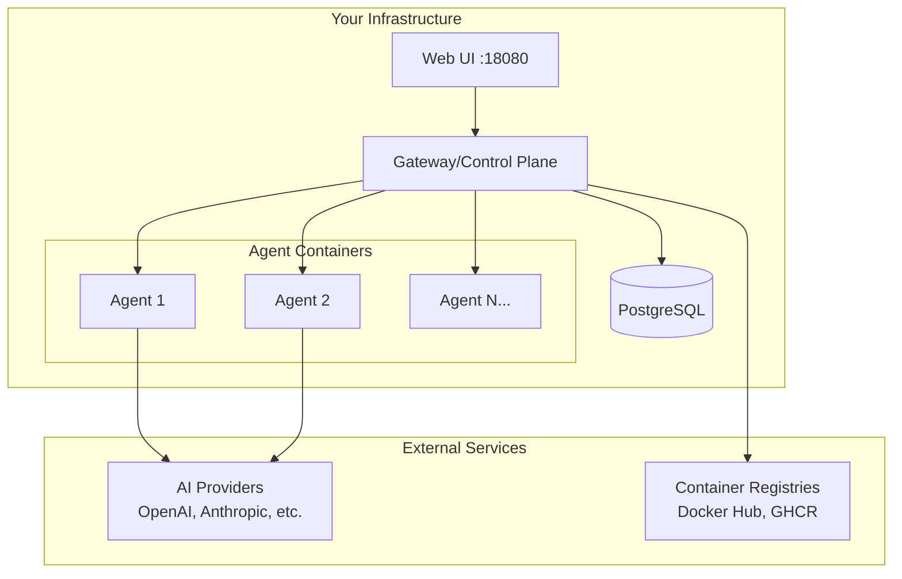
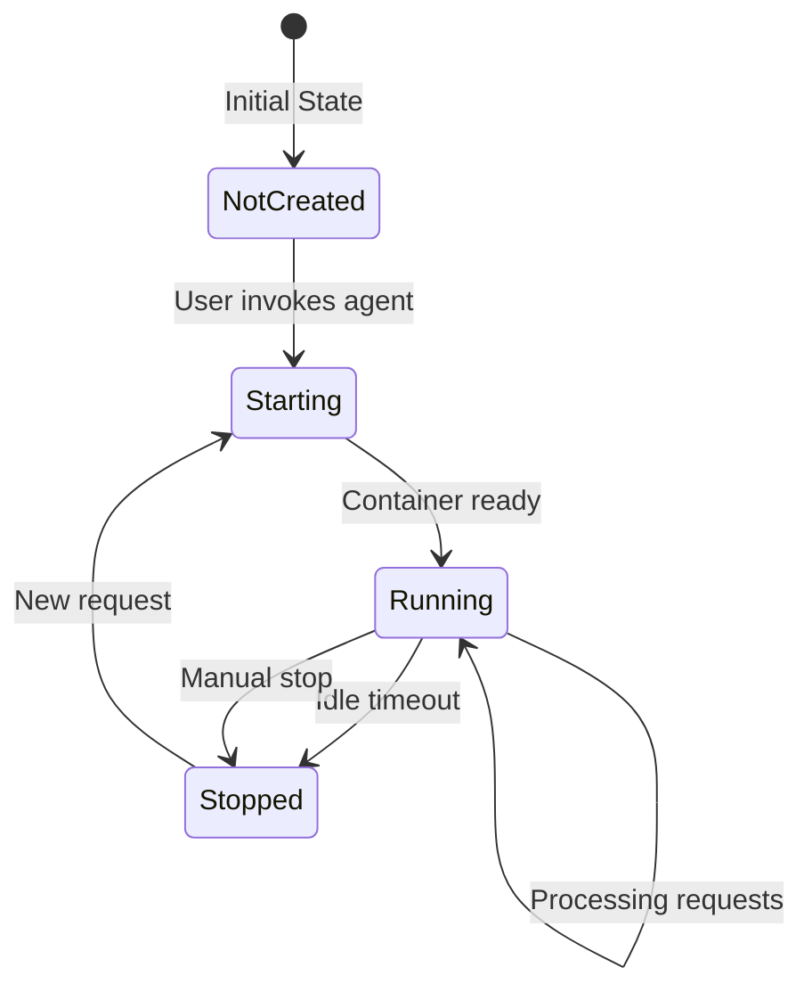
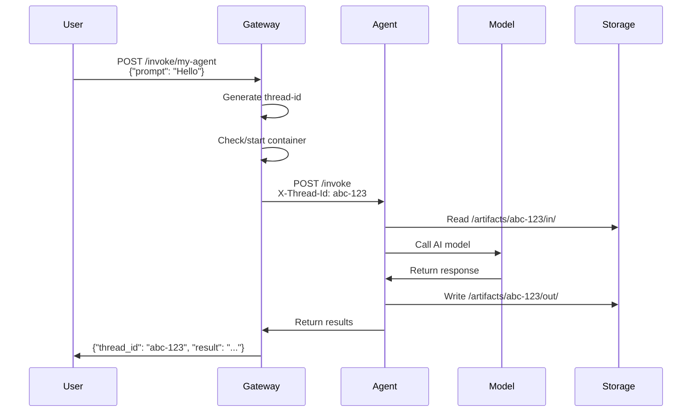

# Core Concepts

Understanding these fundamental concepts will help you work effectively with AgentSystems.

## Platform Architecture

AgentSystems uses a microservices architecture where each component has a specific responsibility:



<AccordionGroup>
  <Accordion title="Gateway (Control Plane)" icon="server">
    The gateway is the central orchestrator that:
    - Routes requests to appropriate agent containers
    - Manages agent lifecycle (start/stop)
    - Enforces security policies
    - Maintains audit logs
    - Handles authentication
  </Accordion>

  <Accordion title="Agent Containers" icon="box">
    Each agent runs in an isolated Docker container that:
    - Implements a standard API contract
    - Processes requests independently
    - Has configurable resource limits
    - Accesses only permitted external services
  </Accordion>

  <Accordion title="Web Interface" icon="desktop">
    The UI provides:
    - Visual agent management
    - Execution monitoring
    - Configuration interfaces
    - File upload/download capabilities
  </Accordion>
</AccordionGroup>

## Key Concepts

### Agents

An **agent** is a containerized application that performs specific AI-powered tasks. Each agent:

- **Is self-contained**: Includes all dependencies in its Docker image
- **Follows a contract**: Implements required `/invoke`, `/health`, and `/metadata` endpoints
- **Is stateless**: Each invocation is independent
- **Can access models**: Uses the platform's model routing to access AI providers

<Info>
  Agents are designed to be composable - you can chain multiple agents together to create complex workflows.
</Info>

### Thread IDs

Every agent execution gets a unique **thread ID** that:

- **Tracks the execution** through all platform components
- **Correlates logs** across gateway, agent, and audit systems
- **Scopes artifacts** to `/artifacts/{thread-id}/` directories
- **Enables monitoring** of long-running operations

Example thread ID: `550e8400-e29b-41d4-a716-446655440000`

### Execution Model

When you invoke an agent:

<Steps>
  <Step title="Request Routing">
    Your request arrives at the gateway with a payload and gets assigned a thread ID
  </Step>

  <Step title="Container Management">
    The gateway checks if the agent container is running, starting it if necessary
  </Step>

  <Step title="Request Forwarding">
    The gateway forwards the request to the agent container with the thread ID header
  </Step>

  <Step title="Processing">
    The agent processes the request, optionally accessing AI models and files
  </Step>

  <Step title="Response">
    The agent returns results, which the gateway forwards back to you
  </Step>
</Steps>

### Container Lifecycle

AgentSystems manages container resources efficiently:



**States explained:**
- **Not Created**: Container doesn't exist yet
- **Starting**: Container is being created/started
- **Running**: Container is active and processing requests
- **Stopped**: Container exists but is not running (saves resources)

### Model Routing

The platform provides **abstract model routing** that allows agents to access AI models without managing credentials:

```python
# In your agent code
from agentsystems_toolkit import get_model

# Uses configuration to route to the right provider
llm = get_model("gpt-4")  # Could be OpenAI, Azure, etc.
llm = get_model("claude-sonnet")  # Could be Anthropic, Bedrock, etc.
```

Benefits:
- **No hardcoded API keys** in agent code
- **Switch providers** without changing agents
- **Centralized configuration** for all model connections

### File Artifacts

The platform provides a structured file system for agent I/O:

```
/artifacts/
└── {thread-id}/
    ├── in/          # Input files uploaded by user
    │   └── data.csv
    └── out/         # Output files created by agent
        └── results.pdf
```

**Key points:**
- Files are scoped to thread IDs
- Input/output separation
- Automatic cleanup policies
- Volume-based persistence

### Security Model

AgentSystems implements defense-in-depth:

<Tabs>
  <Tab title="Container Isolation">
    - Each agent runs in its own container
    - Resource limits prevent abuse
    - Network policies control communication
    - No direct access to host system
  </Tab>

  <Tab title="Credential Management">
    - API keys stored as environment variables
    - Agents never see credentials directly
    - Gateway handles authentication
    - Separate credentials per provider
  </Tab>

  <Tab title="Egress Control">
    - Per-agent network allowlists
    - HTTP proxy enforcement
    - Default-deny policy
    - Audit logging of connections
  </Tab>

  <Tab title="Audit Trail">
    - Every operation logged
    - Cryptographic hash chaining
    - Tamper-evident design
    - Queryable history
  </Tab>
</Tabs>

### Configuration Hierarchy

Configuration in AgentSystems follows this hierarchy:

1. **Platform Configuration** (`agentsystems-config.yml`)
   - Model connections
   - Registry settings
   - Agent definitions

2. **Environment Variables** (`.env`)
   - Sensitive credentials
   - Runtime settings
   - Feature flags

3. **Agent Metadata** (`agent.yaml` in each agent)
   - Agent name and version
   - Model dependencies
   - Resource requirements

## Execution Flow Example

Here's a complete example of running an agent:



## Important Patterns

### Stateless Design

Agents should be stateless - each invocation is independent:

<Warning>
  Don't store state between invocations in agent memory. Use external storage or return state to the caller.
</Warning>

### Progress Reporting

For long-running operations, agents can report progress:

```python
from agentsystems_toolkit import progress_tracker as pt

pt.init(thread_id, plan=[
    {"id": "step1", "label": "Loading data"},
    {"id": "step2", "label": "Processing"},
    {"id": "step3", "label": "Generating output"}
])

pt.update(current="step1", percent=33)
```

### Error Handling

The platform handles errors at multiple levels:
- Gateway returns appropriate HTTP status codes
- Agents can return error details in responses
- Audit logs capture all failures
- UI displays user-friendly error messages

## Next Steps

Now that you understand the core concepts:

<CardGroup cols={3}>
  <Card title="Configure the Platform" icon="gear" href="/configuration">
    Set up model connections and agent deployments
  </Card>

  <Card title="Run Agents" icon="play" href="/user-guide/running-agents">
    Learn to execute and monitor agents
  </Card>

  <Card title="Build Agents" icon="hammer" href="/build-agents">
    Create your own custom agents
  </Card>
</CardGroup>