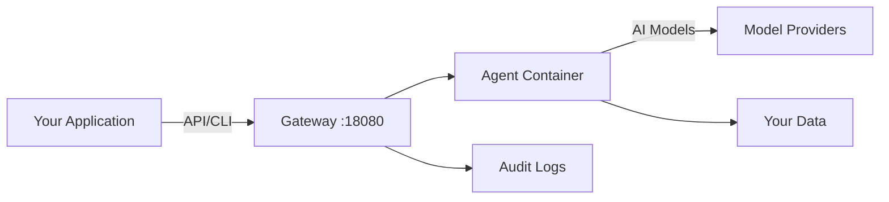

# Welcome to AgentSystems

Run AI agents on your own infrastructure with AgentSystems - an open-source platform for deploying, managing, and building AI agents.

<CardGroup cols={3}>
  <Card title="Quick Start" icon="rocket" href="/getting-started/quickstart">
    Get running in 5 minutes with a simple installation
  </Card>
  <Card title="Configure Models" icon="brain" href="/configuration">
    Connect OpenAI, Anthropic, or local models
  </Card>
  <Card title="Build Agents" icon="hammer" href="/build-agents">
    Create custom agents for your needs
  </Card>
</CardGroup>

## Why AgentSystems?

Organizations and developers use AgentSystems to:

<Columns cols={2}>
  <Card title="Run Agents Locally" icon="server">
    Deploy AI agents on your own hardware, from laptops to data centers
  </Card>

  <Card title="Control Your Data" icon="shield">
    Process sensitive information without sending it to third parties
  </Card>

  <Card title="Choose Your Models" icon="toggle-on">
    Connect to OpenAI, Anthropic, AWS Bedrock, or run models locally with Ollama
  </Card>

  <Card title="Manage Costs" icon="dollar-sign">
    Use your existing compute resources and API keys directly
  </Card>
</Columns>

## How It Works

AgentSystems provides a complete platform for AI agent operations:

1. **Deploy the platform** on your infrastructure
2. **Configure connections** to your preferred AI providers
3. **Run agents** via the web UI, CLI, or API
4. **Build custom agents** using the provided templates

## Key Features

### Platform Capabilities

<AccordionGroup>
  <Accordion title="Container Orchestration" icon="box">
    Each agent runs in an isolated Docker container with configurable resource limits and network policies.
  </Accordion>

  <Accordion title="Model Router" icon="route">
    Abstract model routing allows agents to use different AI providers without code changes. Switch between providers through configuration.
  </Accordion>

  <Accordion title="Audit Trail" icon="list-check">
    Every operation is logged with cryptographic hash chaining for tamper-evident audit trails.
  </Accordion>

  <Accordion title="Agent Hub" icon="store">
    Discover and deploy community-built agents, or share your own creations with others.
  </Accordion>
</AccordionGroup>

### For Platform Users

- **Web UI**: Intuitive interface for managing agents and executions
- **CLI Tools**: Command-line interface for automation and scripting
- **File Processing**: Upload files for agent processing, download results
- **Progress Tracking**: Real-time updates for long-running agent tasks

### For Agent Builders

- **Agent Template**: Start building quickly with our FastAPI-based template
- **Development Tools**: Local testing, debugging, and hot-reload support
- **Model Access**: Simple API to access configured AI models
- **Distribution**: Package and share agents as Docker containers

## Example Use Cases

<Tabs>
  <Tab title="Individual Developers">
    - Test AI agents without cloud costs
    - Build personal automation tools
    - Learn agent development
    - Prototype AI applications
  </Tab>

  <Tab title="Organizations">
    - Process confidential documents locally
    - Analyze sensitive data on-premise
    - Build internal AI tools
    - Maintain compliance requirements
  </Tab>

  <Tab title="Agent Developers">
    - Create specialized agents
    - Package domain expertise
    - Share with the community
    - Build commercial agents
  </Tab>
</Tabs>

## Getting Started

<Steps>
  <Step title="Install the Platform">
    One-line installation gets you started in minutes

    [Quick Start Guide →](/getting-started/quickstart)
  </Step>

  <Step title="Configure AI Models">
    Connect your preferred AI providers or run locally

    [Configuration Guide →](/configuration)
  </Step>

  <Step title="Run Your First Agent">
    Execute the included hello-world agent to verify setup

    [Running Agents →](/user-guide/running-agents)
  </Step>
</Steps>

## Join the Community

<CardGroup cols={2}>
  <Card
    title="GitHub"
    icon="github"
    href="https://github.com/agentsystems/agentsystems"
  >
    Star the project and contribute
  </Card>

  <Card
    title="Discord"
    icon="discord"
    href="https://discord.gg/H26CEWfT"
  >
    Get help and share experiences
  </Card>
</CardGroup>

## Architecture Overview

AgentSystems consists of several integrated components:

| Component | Purpose | Technology |
|-----------|---------|------------|
| [Control Plane](https://github.com/agentsystems/agent-control-plane) | Gateway & orchestration | FastAPI, PostgreSQL |
| [SDK](https://github.com/agentsystems/agentsystems-sdk) | CLI & deployment tools | Python, Docker Compose |
| [UI](https://github.com/agentsystems/agentsystems-ui) | Web interface | React, TypeScript |
| [Toolkit](https://github.com/agentsystems/agentsystems-toolkit) | Agent development | Python, LangChain |
| [Template](https://github.com/agentsystems/agent-template) | Agent scaffold | FastAPI, LangGraph |

<Note>
  AgentSystems is in active development. Join our [Discord](https://discord.gg/H26CEWfT) for updates and to provide feedback.
</Note>